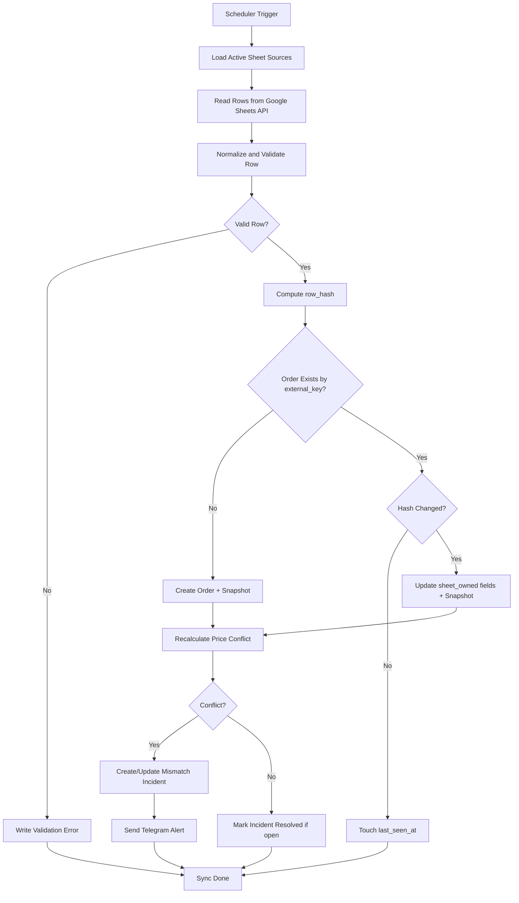
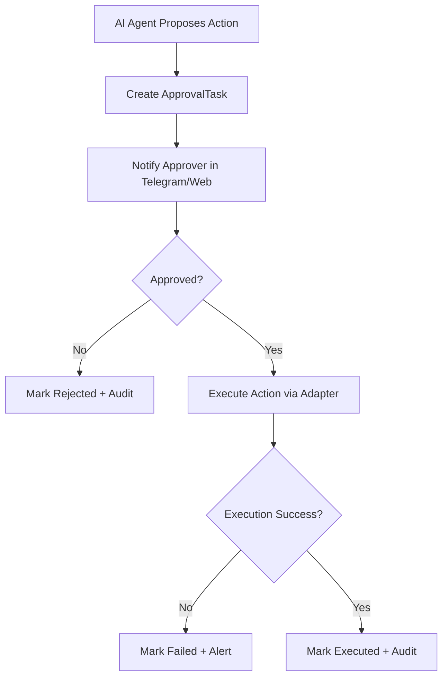
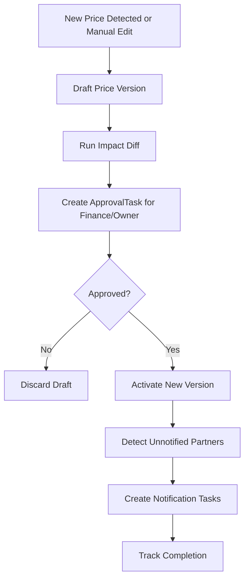
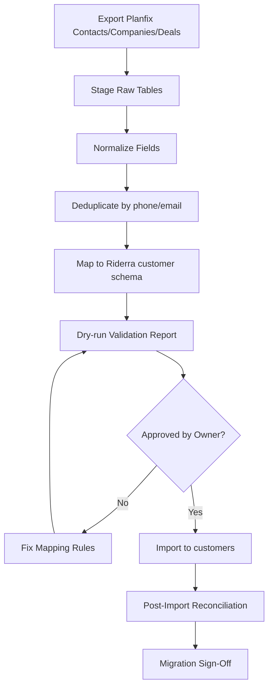

# BPMN Flows (Mermaid)

## 1) Google Sheet -> Riderra Order Sync

```mermaid
flowchart TD
  A[Scheduler Trigger] --> B[Load Active Sheet Sources]
  B --> C[Read Rows from Google Sheets API]
  C --> D[Normalize and Validate Row]
  D --> E{Valid Row?}
  E -- No --> F[Write Validation Error]
  E -- Yes --> G[Compute row_hash]
  G --> H{Order Exists by external_key?}
  H -- No --> I[Create Order + Snapshot]
  H -- Yes --> J{Hash Changed?}
  J -- No --> K[Touch last_seen_at]
  J -- Yes --> L[Update sheet_owned fields + Snapshot]
  I --> M[Recalculate Price Conflict]
  L --> M
  M --> N{Conflict?}
  N -- Yes --> O[Create/Update Mismatch Incident]
  N -- No --> P[Mark Incident Resolved if open]
  O --> Q[Send Telegram Alert]
  P --> R[Sync Done]
  F --> R
  K --> R
  Q --> R
```

## 2) AI Draft -> Approval -> Execute

```mermaid
flowchart TD
  A[AI Agent Proposes Action] --> B[Create ApprovalTask]
  B --> C[Notify Approver in Telegram/Web]
  C --> D{Approved?}
  D -- No --> E[Mark Rejected + Audit]
  D -- Yes --> F[Execute Action via Adapter]
  F --> G{Execution Success?}
  G -- No --> H[Mark Failed + Alert]
  G -- Yes --> I[Mark Executed + Audit]
```

## 3) Price Change Governance

```mermaid
flowchart TD
  A[New Price Detected or Manual Edit] --> B[Draft Price Version]
  B --> C[Run Impact Diff]
  C --> D[Create ApprovalTask for Finance/Owner]
  D --> E{Approved?}
  E -- No --> F[Discard Draft]
  E -- Yes --> G[Activate New Version]
  G --> H[Detect Unnotified Partners]
  H --> I[Create Notification Tasks]
  I --> J[Track Completion]
```

## 4) Planfix Client Migration

```mermaid
flowchart TD
  A[Export Planfix Contacts/Companies/Deals] --> B[Stage Raw Tables]
  B --> C[Normalize Fields]
  C --> D[Deduplicate by phone/email]
  D --> E[Map to Riderra customer schema]
  E --> F[Dry-run Validation Report]
  F --> G{Approved by Owner?}
  G -- No --> H[Fix Mapping Rules]
  H --> F
  G -- Yes --> I[Import to customers]
  I --> J[Post-Import Reconciliation]
  J --> K[Migration Sign-Off]
```
